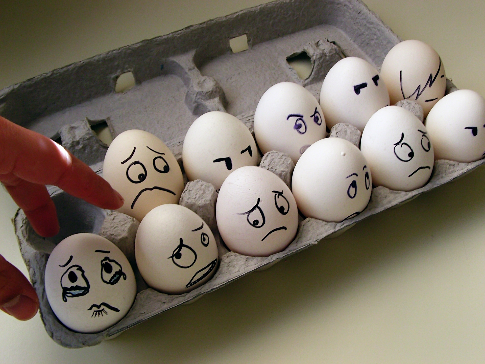
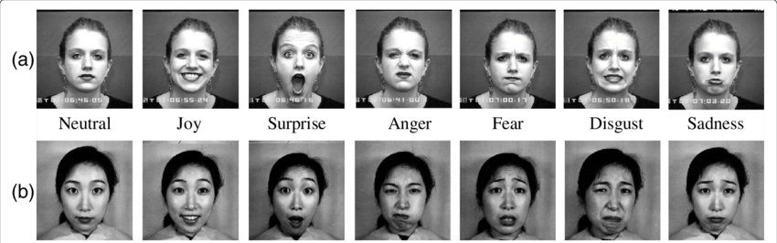
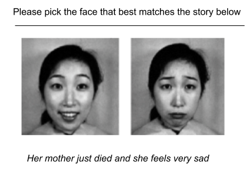

### The Scary Core of A.I Emotion Recognition

[Soucre](https://wallup.net/egg-emotion-tears-faces/?__cf_chl_jschl_tk__=d9172f3dc03af75dec7f7d8a7c74a9aca1f003e3-1604656748-0-AZ7HNvSESqUxp13PvZW8MopLCCsHeRUV-xNmv7lHaPLjgxaroVyAVppzNY8eFgaEFl3kt_RNx014Elc1f4WJV9IHGX-yd7TNsbhMUSbRd10AJi463LaXD8ZLttL0WV2RiKaZSJubhZkgYDJ2DH1CEDD4sFNFOAqP5nnaO19FI_PWK__zoupmO5-8yTzXZlO3aiz2l8AHTUjb5CCidKy19iO7_j8aH1tL9zD9qVs_AXclA737gAy6khLV-2Q4LUSk1A4Av7ZcyIJgJArmq-UV6ykDbuzKeQTvdddQxVzsHBtoyvEeDo-eKQC8e89pDRgDNA)

Hello there, after I caught your attention, lets first switch the popular 'artificial intelligence' (AI) to 'machine learning' (ML) in this context, for the sake of clarity. Both are very hot buzzwords right now, and often used interchangeably, which can lead to some confusion and wrong expectations. Lets stick to following definition here:

> Artificial Intelligence is broad area of computer science that makes machines seem like they have human intelligence.
>
> Machine Learning is basically a 'thing labeler' where you explain your task with examples instead of instructions --- you feed data to machines and let them figure it out on their own

Now, we can start.

Ever since I've done some research for my thesis on using machine learning for emotion recognition by analysing facial expressions --- and discouraged its usage as conclusion, although it "worked" this nagging feeling of something really going wrong on a large scale never left me. More and more Start-ups but also big names in industry develop products whose core functionality is based on a dangerously simplified, even wrong, theory of human emotion. (For elaboration, see '*The problem with the Status-quo'*) This article aims to give a deeper understanding of the problem by first trying to frame it and then dive into its core --- only then, when a problem is well understood, one can start to craft solutions.

This article is structured as following:

-   Preface

-   The problem with the status-quo

-   Understanding the problem we want to solve

-   Ideas on a new approach

-   Conclusion

-   Citations and references

‌I recently finished working through a book that ultimately motivated me to write this article. "[How emotions are made](https://lisafeldmanbarrett.com/books/how-emotions-are-made/)[3]" written by Lisa Feldman Barrett turned out to be an invaluable source of concepts and ideas, heavily backed by scientific evidence. If you have never heard of the theory of constructed emotions, have a look at [this](https://youtu.be/0rbyC5m557I)[4] first. This article is influenced by insights gained from her work and I'll use many of them to back up my concerns with the status-quo and derive a set of questions we should be asking instead.

> "If people are using the wrong understanding of emotion, they can get hurt and other people can get hurt too" --- Lisa Feldman Barett

‌

This lengthy article is not aimed to discourage the idea of using machine learning for emotion recognition tasks. This is here to stay, so my aim as a developer with a nagging conscience is to think about ways on how to design this better. In order to be able to determine the right questions we first need to understand what is currently going wrong.

### **Preface:**

*You stand at the border control of country X after a long, exhausting flight. You notice several cameras in different angles around you but don't think further about them, after all it's an airport, a brand-new one even. Finally, it's your turn. The officer glares at you, before you even had the chance to pass him your documents. You slightly back off, trying to calm yourself that he'd probably had a bad day. Before you know what is happening, border control had already approached. Being tired and irritated you get frightened and upset, gesticulating wildly which worsens the situation. You feel a firm grip and are accompanied out the queue..*

*After a few quite unpleasant hours you finally are allowed to pass. Exhausted and angry you think furiously what the heck did just happen. All of a sudden you remember having read about this new A.I based threat detection system, which uses facial expressions and body posture to help officers detect potential threats. Could it be..?*

If you felt uncomfortable reading this, then we're in the same boat. Ml-based emotion recognition systems are already rolled out in production within different areas. If we don't rethink our approach, the above scenario could become our reality pretty soon.

You might point out now, that, as long as there is a human making the decision at the end, things should be fine. But what if, as in the example above, this fails? Or, even worse, the model itself is flawed and its faulty predictions are taken as objective because they were made by a seemingly unbiased machine?

But, you might say, what makes you so convinced that the model is to blame? After all, the emotion recognition process used is well established and backed by zillions of studies!

This, indeed, is the right question to ask, thus we need to start with looking at some theory first.

### **The problem with the status-quo**

> "The world represented by your training data is the only world you can expect to succeed in" --- Cassie Kozyrkov

Let's start at a seemingly uncontroversial point. I've deliberately used the term **ml-based emotion detection system** until now because this is one of the most common phrases used to describe these kinds of tools. The problem with this and similar phrases is that all of them use the words "**recognition**" or "**detection**" at some point. Both of these words suggest assumptions rather than guesses, a little detail that turns out to be actually the top of an iceberg.

This fallacy has its roots within the classical view of emotions, its most popular flavour being the **basic emotion theory**. This theory basically assumes that emotions are something that has a fingerprint somewhere in the brain, that they are something that is expressed in a way that can be detected and suggesting that there exists an unique set of universal **basic emotions** throughout the entire world population. This idea that our faces hold the [key to access emotions](https://how-emotions-are-made.com/notes/The_Expression_of_the_Emotions_in_Man_and_Animals)
[5] objectively and accurately goes back as far as Charles Darwin's Book [The expression of emotions in man and animal](https://archive.org/details/Darwin1915Emotions)[6] . The human face can be moved by 42 different muscles, leading to all the different movements like smirks, grimaces, blinks, raised brows etc. we see every day. According to the classical view of emotions, each emotion is displayed as a particular pattern of movements --- a **facial expression.** Being happy thus manifests through smiling, being angry is expected to cause the furrow of brows and these facial expressions thus are seen as part of the universal fingerprint basic emotions carry. A lot of studies were conducted that first seemingly supported this view, like a very popular one back in the 1960 by Silvian S. Tomkins, Carroll E. Izard and Paul Ekman. They created a set by instructing actors to display the exaggerated features of what was thought to be the clearest, strongest signals for the underlying basic emotion.

**‌Figure 1**: *The image shows samples of the popular Cohn-Kanade (CK) dataset created for basic emotion method studies and also used for training machine learning models today.*

These kinds of images were then used to estimate how well people perceive facial movements as expressions of emotions [Izard ,1971](https://www.amazon.com/face-emotion-Century-psychology/dp/B0006CFW2S)[8],[Tomkins, Silvian and McCarter, 1964](https://journals.sagepub.com/doi/10.2466/pms.1964.18.1.119)[9].

The method below is still considered the standard today:

***Figure 2:** Basic Emotion Method - picking a word to match the face, image shamelessly adapted from "How emotions are made", Page 6*

***Figure 3:** Basic Emotion Method - picking a face to match the story, image shamelessly adapted from "How emotions are made", Page 6*

This research technique was used to show that people from around the world consistently match the same emotion words (translated into their language) to these posed faces, one very popular study conducted on the Fore people, resident in Papua New Guinea and with little exposure to the western world. Later studies seemed to replicate these results, see e.g [Ekman & Friesen,1971](https://psycnet.apa.org/record/1971-07999-001) [12]; [Ekman, Sorenson & Friesen,1969](https://pubmed.ncbi.nlm.nih.gov/5773719/) [13]. From this evidence scientists concluded that emotion recognition is universal.

Other scientists however started to worry that this might not be accurate enough, as it involved human judgement and tried to verify universal emotional fingerprints instead by using [facial electromyography (EMG)](https://en.wikipedia.org/wiki/Facial_electromyography) [14]. Turns out the results presented a serious challenge to the classical view of emotion, as study after study showed that the muscle movements do not reliably indicate emotional instances of anger, happiness thus failing to serve as a predictable fingerprint. What is detectable, although is the differentiation between pleasant and unpleasant affect. (See '*Understanding the problem we want to solve'*). There are even more studies whose results further question the classical view. In order to check if facial expressions indeed are universal, several [studies](https://how-emotions-are-made.com/notes/Facial_configurations_in_newborns) [15] were conducted on newborns and infants. Further, if there was an universality to be found, removing the emotion word from the basic emotion method shouldn't impact the results, but it did in several [studies](https://www.sciencedirect.com/science/article/abs/pii/S1364661307001532) [16].

> What has been conducted until now is that context matters far more for any kind of emotion recognition than considered in the classical methods.

Ironically, it seems that the classical methods (see Figure 2 and Figure 3) actually created the interpretation context by providing emotional words and framings to choose from. This led the participants to learn the appropriate associations between facial expression and emotions, creating a self-fulfilling prophecy of universality. A lot of recent studies have been conducted further investigating the basic methods, for more in-depth coverage see e.g [Elfenbein, Anger and Ambady, 2002](http://Elfenbein,%20Hillary%20Anger,%20and%20Nalini%20Ambady.%202002.%20“On%20the%20Universality%20and%20Cultural%20Specificity%20of%20Emotion%20Recognition:%20A%20Meta-Analysis.”%20Psychological%20Bulletin%20128%20(2):%20203–235.) or read [Feldman Barrett. (2017) 'The myth of universal emotions' in 'How emotions are made', pp. 42--56.]()

As we see, there seems to be enough evidence to rethink the application of the basic emotion method, yet it is still the default widely embedded in our legal systems, educational systems --- and our machine learning models. See Figure 4 for an example from the Extended Cohn-Kanade dataset CK+[Lucey et al, 2010](https://ieeexplore.ieee.org/abstract/document/5543262?casa_token=Yn78_37RYrwAAAAA:MFFtWwaJte6ob4fFrUX5_-aeVRLOF0bommgm4Gwz8q59fl0HoFjhYEXMSUd74GDiwBy1LDtioA) [17], which is popular amongst the machine learning community.

**Figure 4:** *Examples of the CK+ database. The images on the top level are subsumed from the original CK database and those on the bottom are representative of the extended data. All up 8 emotions and 30 AUs are present in the database. Examples of the Emotion and AU labels are: (a) Disgust --- AU 1+4+15+17, (b) Happy --- AU 6+12+25, © Surprise --- AU 1+2+5+25+27, (d) Fear --- AU 1+4+7+20, (e) Angry --- AU 4+5+15+17, (f) Contempt --- AU 14, (g) Sadness --- AU 1+2+4+15+17, and (h) Neutral --- AU0 are included.*

As machine learning engineers we love pattern recognition and I feel this is both our strength and weakness. We train our models to distinguish between alternatives statistically (say, for many instances of fear vs. anger), so that they can predict future instances reliably.

> The basic emotion theory seems nearly perfect for building a working machine learning model --- ***except, as we've seen above, it provides us with wrong labels all along*.**

To put it in a harsh way for the purpose of better understanding (with my sincere excuses towards the scientists putting honorable effort to craft these theories) --- by using datasets based on the basic emotional theory we inevitable run into [GIGO](https://en.wikipedia.org/wiki/Garbage_in,_garbage_out) [19]

**Figure 5**: Garbage-in-garbage-out [Source](https://blog.temboo.com/make-smart-predictions-with-amazon-machine-learning/) [21]

‌

### **Understanding the problem we want to solve**

Now, after we acknowledge this problem is real, the first reasonable question to ask is: "**How to fix the input data?**"

In order to fix the input data we must have an idea on what this data could look like. For this, we need to understand our problem first.

‌

Our starting question from the beginning is: "**How to detect emotion?**". As seen above, this question leads to bad adaptations, so let's deconstruct it and try to answer the following question instead: "**What is meant by emotion?**" Obviously the current default is insufficient for our needs so lets try with another definition instead:

> Emotions are created from [concepts](https://how-emotions-are-made.com/notes/Glossary) [22] which are the [predictions](https://how-emotions-are-made.com/notes/Glossary) [22] that give meaning to your [[affect](https://how-emotions-are-made.com/notes/Glossary) [22] in your environment.

What matters at our current state is neither the meta-level of concepts nor predictions (yet). **Affects** are the components that emotions are constructed from, so let's try to answer this question: "**What is meant by affect?**"

> Affect is a state defined by fluctuation between pleasant and unpleasant, and between calm and jittery, which themselves are considered basic feelings.

**Figure 6:** *The emotional experiences in question can be characterised on at least two more basic feelings at the same time. The circle maps how similar the feelings are to one another; the dimensions valence and arousal describe the features of similarity. (**Note: feelings != emotions**)*
  

So by deconstructing the question we stumble upon affect and basic feelings, which is something that can actually be measured and created within a scientific environment to some extent. Before we start digging, let's first see if we understand our basic problem better. What we know so far:

‌

-   Emotions themselves can't be measured or detected, they are experienced by the individual or perceived within others as a result of prediction and prediction errors. Their expression is heavily influenced by current affect, cultural background and situational context. Variation is the norm.

-   When we deconstruct the components which can lead to an instance of emotion we stumble upon things that might be a more reliable lead

So, let's reframe the lead question into "**How to detect affect?**". Before we finally look at some hands-on ideas, let's try to understand what we can and can't do in case we succeed in building an **ml-based affect detection**.

I can't tell for sure, being trained as a computer scientist and not as a psychologist but I hope that by detecting affect we can get away from the dangerously simplified assumptions and stop mistaken guesses for certainty. We could instead think about how to use these better detectable basic components to create educated guesses and work towards operating under uncertainty. ‌

Uncertainty is scary to many and given our brains are literally optimised for creating meaning this does not come at a surprise. Most people, me included, prefer certainty. We tend to make quite funny (or dangerous) decisions based on this tendency. The [certainty effect](https://en.wikipedia.org/wiki/Certainty_effect#CITEREFTverskyKahneman1986) [24] introduced by Amos Tversky & Daniel Kahnemann ([Thinking,Fast and Slow](https://www.goodreads.com/book/show/11468377-thinking-fast-and-slow) [25] is another must-read in my opinion) is just one of many examples backing this preference. But, there are whole branches of science that deal with ***how to make better decisions under uncertainty***. (E.g [statistics](https://www.stat.uci.edu/what-is-statistics/) [26] and [decision intelligence](https://towardsdatascience.com/introduction-to-decision-intelligence-5d147ddab767) [27])‌

The devil you know is better than the devil you don't. We need to utilise appropriate tools for the problems at hand and if the problem thrown at us is "detecting emotion" this means we can cause real harm by delivering simplified and simply wrong claims of certainty***.*** Also its simply a dumb and ugly solution. (Kind regards from my inner developer here). How to do better?

### **Ideas on a new approach**

Let's revisit our reframed question: "**How to detect affect?**". (This is really only me brainstorming, so please keep that in mind.)

**What sources could we use for data generation?**

-   [FACS](https://en.wikipedia.org/wiki/Facial_Action_Coding_System) [28] is a system to encode facial movements of individual facial muscles. It is a common standard used to derive emotional expression and also popular amongst animators. If we swap the conclusion of emotional expression and instead try to map FACS encoding to affect, this might be a first step in the right direction.

-   Use body posture and movements as additional sources (if available). I don't know enough about the suitability of this (yet) but it occurs to me that it has potential of adding valuable information.

-   Sensory input from the environment (e.g light, temperature). There are plenty of theories and studies showing how these factors have an impact on our affect so it seems like another potential source to be added.

‌

**How to improve the models further?**

-   ‌The most important ingredient, context, is the hardest to guess and there are plenty of approaches within the ml community, ranging from really questionable to really smart, to squeeze it out of the data.‌

-   As words are the main carrier of concepts and context can be derived from concepts we probably will need to rely heavily on language usage to learn culturally specific information. The methods used for [sentiment analysis](https://en.wikipedia.org/wiki/Sentiment_analysis) [29] are plentiful and probably a great source for adding context.

-   Looking into new approaches like Temporal Convolutional Networks [Hao et al, 2020](https://arxiv.org/abs/2002.12530) [30] or [Geometric Deep Learning](https://medium.com/@flawnsontong1/what-is-geometric-deep-learning-b2adb662d91d) [31] might also be pretty suitable to distill context out of data.

### **Conclusion**

I won't ruminate about model architecture, parameter optimisation and all of this here because this is a future step. We first need to understand the problem space before throwing formulas and magic on it. I hope this article provided helpful with this first step.

I'd love to think and learn about these technical details but I am still not experienced enough, so if someone with more experience in the field also feels inspired to wrap their mind around this problem PLEASE do so and share. We need you.

### **Citations and References**

[Ekman, Sorenson & Friesen 1969] [Ekman, Paul, E. Richard Sorenson, and Wallace V. Friesen. 1969. "Pan-Cultural Elements in Facial Displays of Emotion." Science 164 (3875): 86--88.](https://pubmed.ncbi.nlm.nih.gov/5773719/) [13]

[Izard, 1971] [Izard, Carroll E. 1971. The Face of Emotion. East Norwalk, CT: Appleton-Century-Crofts](https://www.amazon.com/face-emotion-Century-psychology/dp/B0006CFW2S) [8]

[Tomkins, Silvian and McCarter, 1964] [Tomkins, Silvan S., and Robert McCarter. 1964. "What and Where Are the Primary Affects? Some Evidence for a Theory." Perceptual and Motor Skills 18 (1): 119--158.](https://journals.sagepub.com/doi/10.2466/pms.1964.18.1.119) [9]

[Ekman & Friesen 1971] [Ekman, Paul, and Wallace V. Friesen. 1971. "Constants Across Cultures in the Face and Emotion." Journal of Personality and Social Psychology 17 (2): 124--129](https://psycnet.apa.org/record/1971-07999-001) [12]

[Elfenbein, Anger and Ambady, 2002] [Elfenbein, Hillary Anger, and Nalini Ambady. 2002. "On the Universality and Cultural Specificity of Emotion Recognition: A Meta-Analysis." Psychological Bulletin 128 (2): 203--235](http://Elfenbein,%20Hillary%20Anger,%20and%20Nalini%20Ambady.%202002.%20“On%20the%20Universality%20and%20Cultural%20Specificity%20of%20Emotion%20Recognition:%20A%20Meta-Analysis.”%20Psychological%20Bulletin%20128%20(2):%20203–235.)

[Lucey et al, 2010] [P. Lucey, J. F. Cohn, T. Kanade, J. Saragih, Z. Ambadar and I. Matthews, "The Extended Cohn-Kanade Dataset (CK+): A complete dataset for action unit and emotion-specified expression,"]{.ul} [*2010 IEEE Computer Society Conference on Computer Vision and Pattern Recognition --- Workshops*, San Francisco, CA, 2010, pp. 94--101, doi: 10.1109/CVPRW.2010.5543262.](https://ieeexplore.ieee.org/abstract/document/5543262?casa_token=Yn78_37RYrwAAAAA:MFFtWwaJte6ob4fFrUX5_-aeVRLOF0bommgm4Gwz8q59fl0HoFjhYEXMSUd74GDiwBy1LDtioA) [17]

[Hao et al, 2020] [Hongyan Hao and Yan Wang and Yudi Xia and Jian Zhao and Furao Shen, "Temporal Convolutional Attention-based Network For Sequence Modeling", 2020](https://arxiv.org/abs/2002.12530) [30]